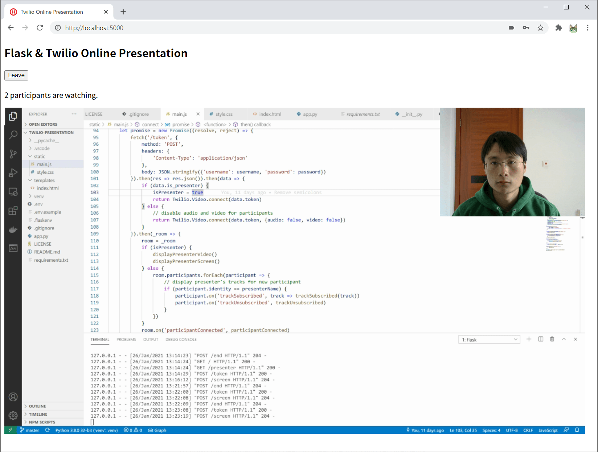

# Twilio Presentation

This is a simple online presentation application build with Flask and Twilio Video API.



## Installation

Clone the repo and build the environment:
```
$ git clone https://github.com/greyli/twilio-presentation
$ cd twilio-presentation
$ python3 -m venv venv  # use "python -m venv venv" on Windows
$ . venv/bin/activate  # use "venv\Scripts\activate" on Windows
(venv) $ pip install -r requirements.txt
```

Rename the `.env.example` to `.env`, fill the credential variables in it (You will need to register a free [Twilio account](http://www.twilio.com/referral/w6qBg0)).

Run the application with:
```
(venv) $ flask run
```

Now open http://localhost:5000/present to start the presentation, then open more tabs on http://localhost:5000 to join the presentation.
